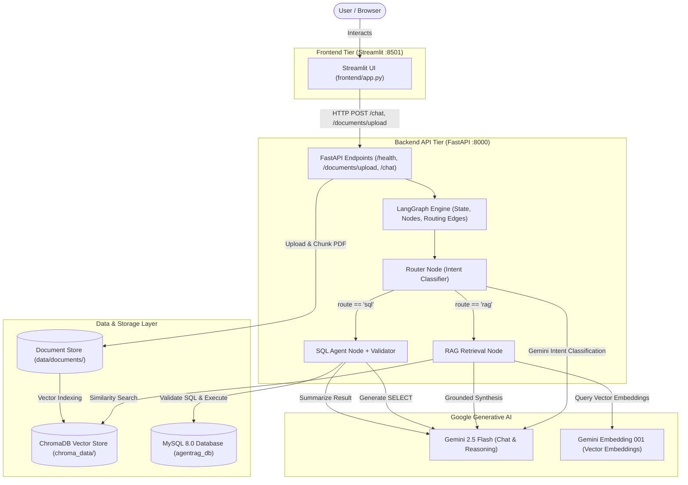
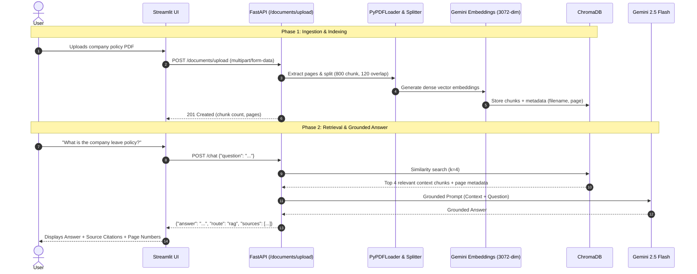
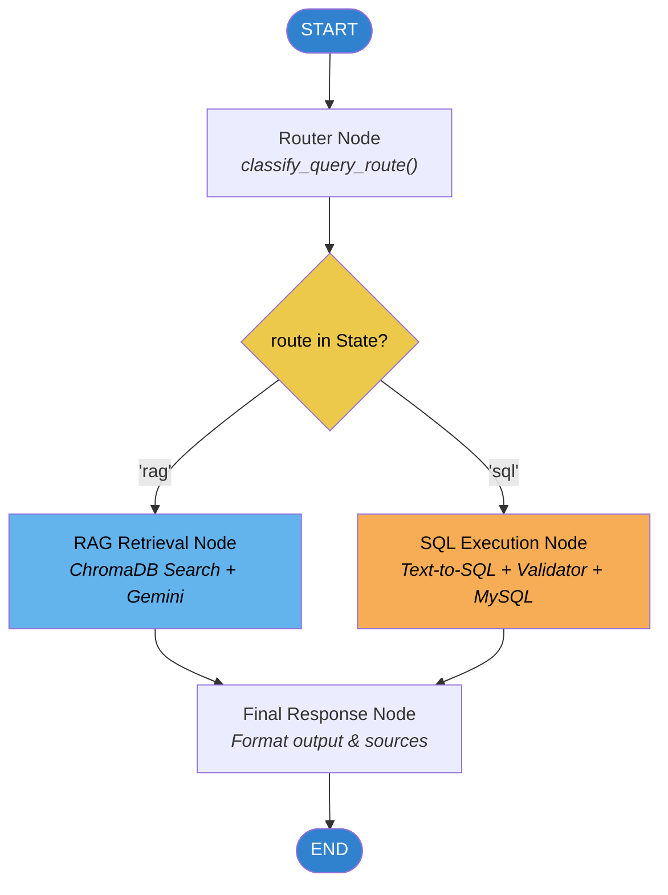

# AgentRAG – Enterprise Knowledge Assistant

[](https://python.org)
[](https://fastapi.tiangolo.com)
[](https://github.com/langchain-ai/langgraph)
[](https://python.langchain.com)
[](https://streamlit.io)
[](https://www.trychroma.com)
[](https://www.mysql.com)
[](LICENSE)

An intelligent, production-principled GenAI assistant designed to answer enterprise questions across **unstructured documents** (PDF policies) and **structured relational data** (MySQL employee database). Powered by **LangGraph** for deterministic query routing, **LangChain** and **ChromaDB** for Document RAG, and **Google Gemini 2.5 Flash** for grounded reasoning and text-to-SQL synthesis.

> 🎬 **Project Walkthrough Video:** Watch the silent HD walkthrough at [**`docs/demo_video.mp4`**](docs/demo_video.mp4) (42-second UI, RAG, and SQL architecture tour).  
> 📚 **Interview & Architecture Masterclass:** Download the complete 9-page [**AgentRAG Project & Technical Interview Guide (PDF)**](docs/AgentRAG_Project_and_Interview_Guide.pdf) covering end-to-end flows, RAG concepts, ChromaDB vs alternatives, Text-to-SQL security, and 25+ interview Q&As!

---

## 📑 Table of Contents
1. [Project Overview](#1-project-overview)
2. [Problem Statement](#2-problem-statement)
3. [Key Features](#3-key-features)
4. [System Architecture](#4-system-architecture)
5. [RAG Pipeline Workflow](#5-rag-pipeline-workflow)
6. [LangGraph Workflow](#6-langgraph-workflow)
7. [Tech Stack & Technology Rationale](#7-tech-stack--technology-rationale)
8. [Project Structure](#8-project-structure)
9. [Local Setup Instructions](#9-local-setup-instructions)
10. [Docker Deployment](#10-docker-deployment)
11. [API Endpoints](#11-api-endpoints)
12. [Example Questions](#12-example-questions)
13. [Security & Guardrails](#13-security--guardrails)
14. [Limitations & Future Enhancements](#14-limitations--future-enhancements)
15. [Resume Bullets](#15-resume-bullets)

---

## 1. Project Overview

Enterprises store mission-critical data in disparate formats:
- **Unstructured:** Employee manuals, remote work guidelines, compliance guidelines, and refund terms in PDFs.
- **Structured:** Employee rosters, departmental hierarchy, salary brackets, and joining dates in relational databases.

**AgentRAG** acts as a unified knowledge interface. Users ask natural language questions in a single interface, and the system intelligently routes the question to either the RAG subsystem or the MySQL SQL engine, strictly preventing hallucinations and SQL injection.

---

## 2. Problem Statement

1. **Information Silos:** Employees spend significant time looking up policies in lengthy PDF manuals or requesting HR/finance teams to write database queries.
2. **LLM Hallucinations:** Standard LLMs invent plausible-sounding policies or facts when asked company-specific questions.
3. **Data Security Risks in Text-to-SQL:** Exposing an LLM directly to a relational database can lead to data loss or corruption if the model generates destructive statements like `DROP` or `DELETE`.

AgentRAG addresses all three issues by combining **Retrieval-Augmented Generation (RAG)** with strict document grounding, **LangGraph conditional routing**, and a **defensive SQL security validator**.

---

## 3. Key Features

- **Document Q&A (RAG):** Upload any enterprise PDF; extracts text, generates embeddings with Gemini, indexes into persistent ChromaDB, and answers questions with exact page citations.
- **Strict Anti-Hallucination Guardrail:** Answers strictly from retrieved document excerpts. If information is absent, returns:  
  `"I could not find this information in the available documents."`
- **Natural Language to SQL:** Translates employee and department inquiries into optimized MySQL SELECT statements.
- **Destructive SQL Rejection:** Blocks all non-SELECT queries (`INSERT`, `UPDATE`, `DELETE`, `DROP`, `ALTER`, `TRUNCATE`, `CREATE`, etc.) and multi-statement injection attacks.
- **LangGraph Query Routing:** Deterministic state machine that routes queries without complex monolithic prompts.
- **Decoupled Architecture:** Clean separation between presentation (Streamlit) and business logic (FastAPI REST APIs).
- **Dockerized One-Command Setup:** MySQL, FastAPI, and Streamlit orchestrated with healthchecks and persistent volumes.

---

## 4. System Architecture



---

## 5. RAG Pipeline Workflow



---

## 6. LangGraph Workflow

The workflow implements a lightweight, explainable state graph:



### LangGraph State Schema (`AgentState`):
```python
class AgentState(TypedDict):
    question: str                  # Original user query
    route: str                     # "rag" or "sql"
    context: str                  # Retrieved document excerpts
    sql_query: str                # Cleaned, validated SELECT query
    sql_result: str               # Raw MySQL query output
    answer: str                   # Synthesized natural language response
    sources: List[Dict[str, Any]] # Citations: filename, page, excerpt
```

---

## 7. Tech Stack & Technology Rationale

| Technology | Purpose in Project | Rationale for Choice |
| :--- | :--- | :--- |
| **Python 3.11 / 3.14** | Primary Programming Language | Standard language for GenAI, LangChain, and data systems. |
| **Google Gemini 2.5 Flash** | Reasoning & Generation LLM | Fast inference, low latency, cost-effective, and strong structured output generation. |
| **gemini-embedding-001** | Dense Vector Embeddings | High dimensional representation (3072-dim) capturing fine enterprise semantics. |
| **LangChain** | Document Loaders & Splitters | Standard abstraction for recursive chunking, prompt templates, and PDF loading. |
| **LangGraph** | Workflow & State Orchestration | Models non-linear execution (router branching, state persistence) as an explainable DAG. |
| **ChromaDB** | Vector Database | Lightweight, embedded, requires zero standalone cluster setup, perfect for local persistence. |
| **MySQL 8.0** | Relational Employee Database | Industry standard ACID relational database for structured tabular data. |
| **FastAPI** | REST API Backend | High performance asynchronous web framework with automatic OpenAPI docs and Pydantic validation. |
| **Streamlit** | Frontend User Interface | Rapid development of interactive UI for document uploads and chat without frontend bloat. |
| **Docker & Compose** | Container Orchestration | Ensures reproducible environment across developer and evaluator machines with a single command. |
| **Pytest** | Testing Suite | Automated unit tests and mock integration tests covering API, security, routing, and RAG. |

---

## 8. Project Structure

```
agentic-rag-knowledge-assistant/
│
├── backend/
│   ├── main.py                  # FastAPI application entry point & CORS
│   ├── config.py                # Pydantic BaseSettings & environment loader
│   ├── api/
│   │   ├── __init__.py
│   │   └── routes.py            # API route handlers (/health, /upload, /chat)
│   ├── agent/
│   │   ├── __init__.py
│   │   ├── router.py            # Gemini-powered intent classifier
│   │   ├── sql_node.py          # Text-to-SQL generation and synthesis
│   │   └── graph.py             # LangGraph state machine definition
│   ├── rag/
│   │   ├── __init__.py
│   │   ├── vectorstore.py       # ChromaDB client & retriever setup
│   │   ├── ingestion.py         # PyPDFLoader and RecursiveCharacterTextSplitter
│   │   └── retriever.py         # Grounded retrieval and source citation logic
│   ├── database/
│   │   ├── __init__.py
│   │   ├── connection.py        # SQLAlchemy engine and schema introspection
│   │   └── sql_validator.py     # Strict SQL security guardrail (SELECT-only)
│   ├── models/
│   │   ├── __init__.py
│   │   └── schemas.py           # Pydantic request and response models
│   └── scripts/
│       ├── __init__.py
│       └── generate_sample_pdf.py # Generates fictional company policy PDF
│
├── frontend/
│   └── app.py                   # Streamlit UI communicating via HTTP
│
├── database/
│   └── init.sql                 # MySQL schema (departments, employees) + 25 rows
│
├── data/
│   └── documents/
│       └── sample_company_policies.pdf # 3-page fictional company handbook
│
├── chroma_data/                 # Persistent ChromaDB storage directory
├── tests/
│   ├── test_health.py           # /health endpoint unit tests
│   ├── test_sql_validator.py    # Destructive SQL rejection & sanitization tests
│   ├── test_router.py           # Intent classification & conditional edge tests
│   ├── test_rag.py              # Context formatting & grounding tests
│   └── test_chat_api.py         # /chat and /upload API tests
│
├── docs/
│   └── interview_questions.md   # 20 technical interview Q&A for freshers
│
├── .env.example                 # Environment configuration template
├── .gitignore                   # Git ignore file (prevents secret leaks)
├── requirements.txt             # Python dependencies
├── Dockerfile                   # Multi-service container image definition
├── docker-compose.yml           # MySQL, Backend, and Frontend orchestration
└── README.md                    # Project documentation
```

---

## 9. Local Setup Instructions

### Prerequisites
- Python 3.11 or higher
- MySQL Server (optional if running locally; Docker Compose is also provided)
- Google Gemini API Key ([Get an API Key](https://aistudio.google.com/))

### 1. Clone the Repository
```bash
git clone https://github.com/your-username/agentic-rag-knowledge-assistant.git
cd agentic-rag-knowledge-assistant
```

### 2. Create and Activate Virtual Environment
```bash
python -m venv venv

# Windows
venv\Scripts\activate

# macOS / Linux
source venv/bin/activate
```

### 3. Install Dependencies
```bash
pip install --upgrade pip
pip install -r requirements.txt
```

### 4. Configure Environment Variables
Copy `.env.example` to `.env` and fill in your Gemini API key and MySQL credentials:
```bash
cp .env.example .env
```
Ensure your `.env` contains:
```ini
GEMINI_API_KEY=your_gemini_api_key_here
LLM_MODEL=gemini-2.5-flash
EMBEDDING_MODEL=gemini-embedding-001
MYSQL_HOST=localhost
MYSQL_PORT=3306
MYSQL_DATABASE=agentrag_db
MYSQL_USER=root
MYSQL_PASSWORD=root
MYSQL_ROOT_PASSWORD=root
CHROMA_PERSIST_DIRECTORY=./chroma_data
DATA_DOCUMENTS_DIRECTORY=./data/documents
BACKEND_URL=http://localhost:8000
```

### 5. Seed Local Database & Sample Document
```bash
# Seed MySQL database tables and 25 employees
python -c "
import pymysql
conn = pymysql.connect(host='localhost', port=3306, user='root', password='root', autocommit=True)
with conn.cursor() as cur:
    for stmt in open('database/init.sql').read().split(';'):
        if stmt.strip(): cur.execute(stmt)
print('Database seeded!')
"

# Generate fictional company policy document
python backend/scripts/generate_sample_pdf.py
```

### 6. Start the FastAPI Backend
```bash
uvicorn backend.main:app --host 127.0.0.1 --port 8000 --reload
```
API Documentation will be live at: [http://127.0.0.1:8000/docs](http://127.0.0.1:8000/docs)

### 7. Start the Streamlit Frontend (New Terminal)
```bash
streamlit run frontend/app.py
```
Open [http://localhost:8501](http://localhost:8501) in your browser.

---

## 10. Docker Deployment

The entire stack (MySQL, FastAPI, and Streamlit) can be launched with a single command:

```bash
docker compose up --build
```

### Service Map:
- **Streamlit Web UI:** [http://localhost:8501](http://localhost:8501)
- **FastAPI Backend:** [http://localhost:8000](http://localhost:8000)
- **Interactive Swagger Docs:** [http://localhost:8000/docs](http://localhost:8000/docs)
- **MySQL Database:** `localhost:3306`

### Persistent Volumes:
- `mysql_data`: Preserves all MySQL table data across restarts.
- `chroma_data`: Preserves vector embeddings and document indexes across restarts.

---

## 11. API Endpoints

### 1. Health Check
`GET /health`  
Returns operational readiness of MySQL and ChromaDB.

**Response (200 OK):**
```json
{
  "status": "healthy",
  "database": "connected",
  "vector_store": "ready",
  "documents_count": 9
}
```

---

### 2. Document Upload
`POST /documents/upload`  
Uploads and indexes a PDF document into ChromaDB.

**Request:** `multipart/form-data` with `file: <binary_pdf>`

**Response (201 Created):**
```json
{
  "message": "Document successfully processed and indexed into vector database.",
  "filename": "sample_company_policies.pdf",
  "chunks_ingested": 9,
  "total_pages": 3
}
```

---

### 3. Chat Query
`POST /chat`  
Processes questions through LangGraph routing.

**RAG Request Example:**
```json
{
  "question": "What is the company leave policy?"
}
```
**RAG Response (200 OK):**
```json
{
  "answer": "All full-time employees are entitled to 20 days of paid annual leave per calendar year, accrued monthly at 1.66 days. In addition, employees receive 10 days of paid sick leave, 16 weeks of paid parental leave for primary caregivers, and up to 5 consecutive paid business days for bereavement.",
  "route": "rag",
  "sources": [
    {
      "source": "sample_company_policies.pdf",
      "page": 1,
      "content": "All full-time employees are entitled to 20 days of paid annual leave per calendar year, accrued monthly at 1.66 days..."
    }
  ],
  "sql_query": null
}
```

**SQL Request Example:**
```json
{
  "question": "How many employees are in Engineering?"
}
```
**SQL Response (200 OK):**
```json
{
  "answer": "There are 8 employees in Engineering.",
  "route": "sql",
  "sources": [],
  "sql_query": "SELECT COUNT(e.employee_id) FROM employees e JOIN departments d ON e.department_id = d.department_id WHERE LOWER(d.department_name) = LOWER('Engineering')"
}
```

---

## 12. Example Questions

### Document RAG Questions (Unstructured Policy Document)
| Question | Expected Route | Grounded Details Retrieved |
| :--- | :---: | :--- |
| *"What is the company leave policy?"* | `RAG` | 20 days annual, 10 sick, 16 weeks parental, 5 days bereavement |
| *"What are the core working hours?"* | `RAG` | Core hours 10:00 AM – 4:00 PM EST, 40 hours/week |
| *"What is the remote work stipend?"* | `RAG` | $500 one-time home office equipment, $60 monthly internet subsidy |
| *"What is the refund policy?"* | `RAG` | 14-day full refund for monthly licenses; 30-day prorated for annual |
| *"What is the pet insurance policy?"* | `RAG` | *"I could not find this information in the available documents."* |

### Database Questions (Structured MySQL Data)
| Question | Expected Route | Executed SQL Query |
| :--- | :---: | :--- |
| *"How many employees are in Engineering?"* | `SQL` | `SELECT COUNT(e.employee_id) FROM employees e JOIN departments d ON e.department_id = d.department_id WHERE LOWER(d.department_name) = 'engineering'` |
| *"What is the average salary?"* | `SQL` | `SELECT ROUND(AVG(salary), 2) FROM employees` |
| *"How many employees joined in 2025?"* | `SQL` | `SELECT COUNT(employee_id) FROM employees WHERE YEAR(joining_date) = 2025` |
| *"Who is the Chief Financial Officer?"* | `SQL` | `SELECT name, salary FROM employees WHERE designation LIKE '%Chief Financial Officer%'` |

---

## 13. Security & Guardrails

1. **Destructive SQL Rejection:**  
   The application blocks all state-modifying SQL commands. If a user asks *"Drop the employees table"* or attempts injection, the system returns:  
   `Security Error: Destructive SQL command forbidden: 'DROP'.`
2. **Single Statement Restriction:**  
   Chained queries separated by semicolons (`SELECT 1; DROP TABLE employees`) are blocked before reaching MySQL.
3. **Anti-Hallucination Guardrails:**  
   RAG prompts require Gemini to answer strictly from retrieved context excerpts.
4. **Input Validation:**  
   Pydantic schemas reject empty questions and non-PDF file uploads with appropriate HTTP 400 status codes.
5. **No Secret Leakage:**  
   API keys and database passwords are loaded exclusively from `.env` and are strictly excluded via `.gitignore`.

---

## 14. Limitations & Future Enhancements

### Limitations
- **Single-Table / Small Joins:** Designed for single-database relational queries; does not join across multiple external SQL servers.
- **Pure Semantic Search:** Relies on dense vector similarity; exact keyword match (e.g. acronyms or error codes) benefits from hybrid search.
- **In-Memory Graph State:** LangGraph state is held in-memory per request rather than stored in a persistent Redis/PostgreSQL checkpointer.

### Future Enhancements
- **Hybrid Search (BM25 + Dense Vectors):** Implement Reciprocal Rank Fusion (RRF) combining keyword and vector scoring.
- **Role-Based Access Control (RBAC):** Restrict sensitive salary figures based on user role authentication.
- **Streaming Responses:** Implement Server-Sent Events (SSE) for token-by-token UI rendering.

---

## 15. Resume Bullets

This project legitimately supports the following resume highlights:

- **AgentRAG – Enterprise Knowledge Assistant**  
  *Python, FastAPI, LangChain, LangGraph, Gemini 2.5 Flash, ChromaDB, MySQL, Streamlit, Docker*
  - Built an enterprise RAG knowledge assistant using LangChain, Google Gemini, and ChromaDB to extract, chunk, embed, and retrieve PDF policy documents with exact page citations and zero hallucination.
  - Implemented a LangGraph query routing workflow utilizing conditional state edges to automatically classify user intent between document retrieval (RAG) and relational queries (SQL).
  - Developed a Text-to-SQL pipeline with custom AST/regex security validators enforcing read-only SELECT execution across MySQL tables, rejecting destructive commands and SQL injections.
  - Created REST APIs using FastAPI and an interactive Streamlit UI, fully containerized with Docker Compose orchestrating MySQL, FastAPI, and Streamlit with persistent volume mounts.
